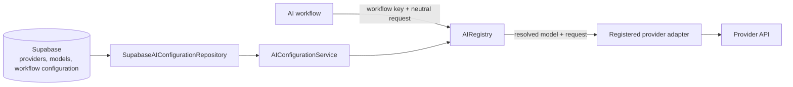
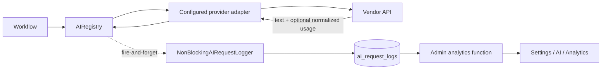

# AI provider architecture

ReachAgent resolves AI providers and models per workflow from Supabase. Runtime
selection is independent of the editor, CLI, IDE, or coding agent used to modify
the repository.

## Runtime flow



A workflow identifies itself with a stable workflow key but does not select a
provider or model. The repository loads configuration, the service validates
and caches it, and the registry resolves the workflow assignment. The provider
receives a complete request and does not know why its model was selected.

## Separation of responsibilities

### Supabase repository

`src/ai/configuration/repositories/SupabaseAIConfigurationRepository.ts` is the
only AI configuration component that knows about Supabase or the physical
database schema. It:

- queries enabled workflow assignments;
- follows each assignment to an enabled model and provider;
- translates database rows into provider-neutral configuration records; and
- reports database and relationship errors.

It does not cache, choose defaults, register providers, or perform business
logic. Another database implementation can replace it by implementing
`AIConfigurationRepository`.

### Configuration service

`src/ai/configuration/AIConfigurationService.ts` depends only on the repository
interface. It:

- validates supported workflow coverage;
- rejects duplicate assignments and empty provider/model keys;
- exposes a workflow-to-provider-and-model lookup;
- shares concurrent in-flight loads; and
- maintains the process-local configuration cache.

It contains no Supabase queries, table names, provider SDK code, or business
logic. Invalid or incomplete configuration fails explicitly. There is no
source-code provider or model fallback.

### Registry

`src/ai/AIRegistry.ts` depends on the generic configuration service and provider
interface. It:

1. receives the workflow key and provider-neutral request;
2. obtains that workflow's provider/model assignment;
3. resolves the provider from its in-process registrations;
4. injects the configured model; and
5. invokes the provider.

It does not know about Supabase, environment-variable names, provider SDKs,
prompts, or business rules.

### Runtime composition

`src/ai/AIRuntime.ts` is the composition root. It constructs the Supabase
repository, configuration service, registry, and currently available provider
adapters. Provider-specific construction and registration belong here rather
than in generic layers.

### Provider interface and adapters

`src/ai/AIProvider.ts` defines provider-neutral generation contracts. Adapters
under `src/ai/providers/` translate those contracts to vendor SDKs.
`AnthropicProvider`, `OpenAIProvider`, and `GeminiProvider` are registered runtime adapters.

Adapters may contain SDK translation, credentials, rate limiting, and
provider-specific error handling. They must not contain workflow rules, prompts,
model defaults, provider selection, or business logic.

## AI settings isolation

AI selection uses dedicated relational tables rather than the general
`settings` key/value table. The general table is suitable for independent
application values such as quotas and delays, but a single
`active_ai_provider` setting would impose one provider on every AI workflow.
That would prevent mixed-provider operation and duplicate relational data in a
string setting.

`ai_workflow_configurations` is therefore the source of truth for active AI
assignments. Each workflow independently references one model, and each model
belongs to one provider. Phase 2.1 seeds every assignment to Anthropic, so this
normalization does not change current runtime selection.

## Database schema

Migration `supabase/migrations/032_ai_configuration.sql` creates and seeds:

### `ai_providers`

| Column | Purpose |
| --- | --- |
| `id` | Internal UUID primary key |
| `provider_key` | Stable registry/database key |
| `display_name` | Human-readable name |
| `enabled` | Whether assignments may use the provider |
| `created_at`, `updated_at` | Audit timestamps |

### `ai_models`

| Column | Purpose |
| --- | --- |
| `id` | Internal UUID primary key |
| `provider_id` | Owning provider |
| `model_key` | Exact identifier sent to the provider |
| `display_name` | Human-readable model name |
| `enabled` | Whether assignments may use the model |
| `created_at`, `updated_at` | Audit timestamps |

Each provider/model key pair is unique. Models are catalog entries and are not
duplicated when several workflows share one model.

### `ai_workflow_configurations`

| Column | Purpose |
| --- | --- |
| `id` | Internal UUID primary key |
| `workflow_key` | Stable, unique application workflow |
| `model_id` | Active model; its relation identifies the provider |
| `enabled` | Whether the assignment is active |
| `created_at`, `updated_at` | Audit timestamps |

The unique workflow key enforces one active row per known workflow. RLS permits
authenticated users and the service role, consistent with the existing
configuration architecture. Runtime reads use the service-role client.

## Cache lifecycle

The service caches one validated configuration snapshot for 60 seconds:

1. the first request after startup loads through the repository;
2. concurrent requests share the same in-flight promise;
3. requests within the TTL reuse the snapshot;
4. the first request after expiry reloads it; and
5. `invalidate()` discards the snapshot so the next request reloads immediately.

The cache is process-local. Each Next.js or Trigger.dev process refreshes
independently. A future Settings UI can call an authenticated server-side
invalidation path after a successful configuration transaction; no service API
rename or architectural change is required. Cross-process invalidation is
intentionally deferred.

## Provider lifecycle

1. Implement the generic `AIProvider` interface in a provider adapter.
2. Add the provider's runtime secret handling.
3. Register the adapter in `AIRuntime.ts`.
4. Insert and enable the provider and its models.
5. Point selected workflow rows at those models.
6. Invalidate configuration or allow the TTL to expire.

Registration makes an adapter available; it does not make the provider active.
The database assignment controls activation.

## Workflow lifecycle

1. Define a stable generic workflow key in `AIConfiguration.ts`.
2. Pass that key from the workflow's existing registry call.
3. Insert an enabled workflow configuration referencing an enabled model.
4. Ensure every deployed provider intended for that workflow has a suitable
   model catalog entry.

Changing a workflow's provider or model later is a database transaction plus
cache invalidation. Prompts, business logic, Trigger.dev tasks, and API
responses do not change.

## Current workflow mapping

Phase 2.1 seeds every workflow assignment to Anthropic. Phases 3 and 4 preserve
those assignments while adding OpenAI and Gemini to the provider and model catalog:

| Workflow | Provider | Model | Runtime use |
| --- | --- | --- | --- |
| `website_extraction` | Anthropic | Claude Haiku 4.5 | Website description, services, and social extraction |
| `contact_email_extraction` | Anthropic | Claude Haiku 4.5 | Contact email extraction from supplied text |
| `agentic_email_search` | Anthropic | Claude Sonnet 4.6 | Multi-round agentic contact search |
| `outreach_email_generation` | Anthropic | Claude Sonnet 4.6 | Initial outreach email generation |
| `outreach_dm_generation` | Anthropic | Claude Sonnet 4.6 | Outreach DM generation |
| `reactivation_email_generation` | Anthropic | Claude Sonnet 4.6 | Reserved mapping preserving the established assignment |

The current reactivation and follow-up writers remain deterministic and make no
provider request. Their behaviour is unchanged.

Migration `supabase/migrations/033_add_openai_provider.sql` adds the OpenAI
provider with `gpt-5` and `gpt-5-mini`. Assigning either model to a workflow is
a database-only change; no workflow code changes are required.

Migration `supabase/migrations/034_add_gemini_provider.sql` adds the Gemini
provider with `gemini-2.5-pro` and `gemini-2.5-flash`. It does not change any
existing provider, model, or workflow assignment.

## Mixed-provider operation

The schema and service already support independent assignments such as:

```text
website_extraction          -> Anthropic model
outreach_email_generation   -> OpenAI model
agentic_email_search        -> Gemini model
outreach_dm_generation      -> Gemini model
```

Because the Anthropic, OpenAI, and Gemini adapters are implemented and registered,
switching among them requires only a workflow-assignment update. No registry,
service, workflow, prompt, business-logic, API, or Trigger.dev refactor is needed.

## Adding or changing a model

1. Insert and enable the model under its provider.
2. Update the selected `ai_workflow_configurations.model_id` in a transaction.
3. Invalidate the cache or allow its TTL to expire.

No workflow or adapter code changes for a model-only update.

## Hardcoding rules

The following must never be hardcoded in workflows, generic configuration
layers, Trigger.dev tasks, API routes, or business logic:

- active providers;
- workflow model identifiers;
- provider or model defaults;
- provider-selection conditions; or
- model-selection conditions.

Stable workflow keys and provider adapter registrations belong in source code.
Provider credentials remain runtime secrets. Provider/model availability and
workflow assignments belong in the AI configuration tables.

Development tools—including Codex CLI, Claude Code, Command Code, Cursor,
Windsurf, and future coding agents—have no place in this runtime flow and must
never affect provider or model selection.

## AI observability and analytics

Phase 6 adds observability around the existing registry boundary. It does not
change provider selection, prompts, generated output, retry policy, or workflow
control flow.



### Logging flow

The registry records a start timestamp before configuration resolution and a
finish timestamp after the provider returns or throws. Each event includes the
workflow, resolved provider/model when available, status, duration, normalized
token counts, estimated cost, retry count, request source, and a bounded error
message. Failed configuration resolution is also logged, with provider/model
left `NULL` when they could not be resolved.

The administrator provider-connection test intentionally bypasses workflow
selection, so it emits the same event directly with workflow
`provider_connection_test` and request source `settings_connection_test`.

Logging is dispatched without awaiting Supabase. Synchronous dispatch errors and
asynchronous insert failures are written to the server console and never replace
the AI result or exception. The registry rethrows the original generation error.

Metadata is intentionally restricted to maximum requested tokens, message count,
and whether a system instruction was present. Prompt bodies, system instructions,
generated email/DM content, and credentials are never placed in a log record.
Known prompt values and provider credentials are redacted from stored error text.

### Provider-independent token usage

`AIGenerateResponse` exposes optional normalized `inputTokens`, `outputTokens`,
and `totalTokens` fields. Each adapter translates its SDK response once:

- Anthropic: `usage.input_tokens` and `usage.output_tokens`;
- OpenAI Responses API: `usage.input_tokens`, `usage.output_tokens`, and
  `usage.total_tokens`; and
- Gemini: `usageMetadata.promptTokenCount`, `candidatesTokenCount`, and
  `totalTokenCount`.

Missing or malformed usage becomes `NULL`; it never fails generation or logging.
Retry callbacks count provider retries without changing the established delay,
attempt, or retryability rules.

### Cost estimation

`src/ai/observability/pricing.ts` is the only pricing and calculation module.
`estimateCost(provider, model, inputTokens, outputTokens)` uses a configurable
catalogue of standard per-million-token USD rates. Unknown providers/models or
missing token counts return `NULL`. Estimates exclude discounts, batch pricing,
prompt-cache adjustments, tool fees, taxes, and negotiated rates, so the values
are operational estimates rather than invoices. The catalogue should be reviewed
when providers change list prices or models.

### Database and analytics

Migration `036_ai_request_analytics.sql` creates `ai_request_logs`, filter-oriented
indexes, admin-only read policy, service-role insert policy, and
`get_ai_request_analytics`. The SQL function calculates summary metrics and
rankings in PostgreSQL and returns only the 50 most recent matching requests,
avoiding an unbounded raw-history scan in the Next.js process.

The Settings / AI / Analytics page accepts optional date, workflow, provider,
and status filters. Only active administrators can access the page or underlying
rows. It displays request totals, reliability, latency, average estimated cost,
today/month counts, top workflows/models/providers, and recent request details.
